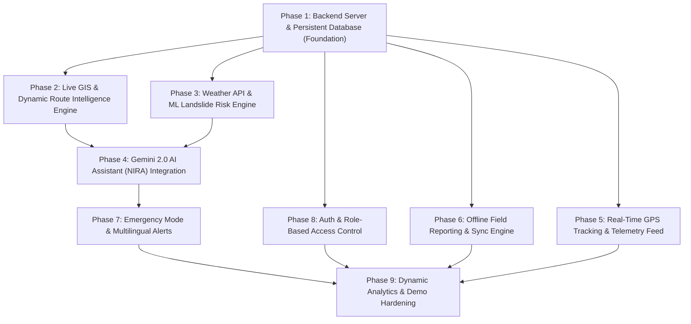

# Implementation Roadmap: NER-LINK AI Platform
**AI-Based Smart Logistics & Accessibility Intelligence Platform for the North Eastern Region (NER)**

---

## 1. Implementation Philosophy & Guidelines

- **Zero Breakage Rule**: Never wipe or break existing UI components, animations, or styling.
- **Pragmatic Hackathon Architecture**: Avoid bloated microservices or multi-cloud overhead. Build a fast, lightweight Node.js/Express TypeScript backend with a local persistent database and clean REST/WebSocket interfaces.
- **Offline-First & Graceful Degradation**: If external APIs (OpenWeather, Gemini) encounter rate limits or missing keys, fallback instantly to robust local simulations and heuristics so the live SIH demo never crashes.

---

## 2. Phase-by-Phase Execution Plan

---

### Phase 1: Backend Server, Database & API Bridge (Foundation)
**Estimated Effort**: 2-3 hours | **Complexity**: Medium | **Dependencies**: None
- [ ] Create `server/` directory with `server.ts` entrypoint utilizing Express and TypeScript (`tsx`).
- [ ] Implement persistent JSON/SQLite storage layer for:
  - Vehicles, Incidents, Field Reports, Shipments, Activities, Notifications, States/Districts.
- [ ] Add REST API endpoints:
  - `GET /api/v1/health`
  - `GET/POST/PUT/DELETE /api/v1/vehicles`
  - `GET/POST/PATCH /api/v1/incidents`
  - `GET/POST/PUT /api/v1/shipments`
  - `GET/POST /api/v1/reports` and `POST /api/v1/reports/sync`
- [ ] Configure Vite dev proxy in `vite.config.ts` to forward `/api` requests to backend server (port 5000).
- [ ] Update `DataContext.tsx` to fetch from backend on mount and sync mutations via REST API while keeping local caching for offline mode.

---

### Phase 2: GIS Engine, Real Highway Corridors & Dynamic Routing
**Estimated Effort**: 2-3 hours | **Complexity**: Medium-High | **Dependencies**: Phase 1
- [ ] Define accurate GeoJSON geographical coordinates for primary NER transit corridors:
  - NH-10 (Siliguri $\leftrightarrow$ Gangtok)
  - NH-27/37 (Guwahati $\leftrightarrow$ Nagaon $\leftrightarrow$ Jorhat $\leftrightarrow$ Dibrugarh)
  - NH-06/44 (Shillong $\leftrightarrow$ Jowai $\leftrightarrow$ Silchar $\leftrightarrow$ Aizawl $\leftrightarrow$ Agartala)
  - NH-29 (Dimapur $\leftrightarrow$ Kohima $\leftrightarrow$ Imphal)
  - NH-13 (Trans-Arunachal Highway $\leftrightarrow$ Itanagar)
- [ ] Implement route engine (`server/services/routingService.ts`) providing:
  - Shortest physical path calculation.
  - Dynamic rerouting around coordinates of active `CRITICAL` incidents.
  - Elevation and slope risk profiling.
- [ ] Upgrade `RouteIntelligence.tsx` and `MapPage.tsx` to render multi-waypoint polyline routes, waypoint nodes, and alternative safe bypass corridors.

---

### Phase 3: Weather API Integration & ML Disruption Risk Engine
**Estimated Effort**: 2 hours | **Complexity**: Medium | **Dependencies**: Phase 1
- [ ] Implement `server/services/weatherService.ts`:
  - Fetch live weather data for NER capitals (Guwahati, Shillong, Itanagar, Aizawl, Imphal, Kohima, Agartala, Gangtok) using OpenWeatherMap API with automatic mock fallback when API key is not present.
- [ ] Implement ML Disruption & Landslide Risk Model (`server/services/mlRiskService.ts`):
  - Calculate landslide & flood hazard index using weighted formula:
    $$\text{Hazard} = 0.40 \cdot \text{Rainfall} + 0.25 \cdot \text{Slope} + 0.20 \cdot \text{Vulnerability} + 0.15 \cdot \text{IncidentDensity}$$
- [ ] Connect weather and ML hazard data to `Districts.tsx`, `RouteIntelligence.tsx`, and `MapPage.tsx`.

---

### Phase 4: Gemini 2.0 AI Assistant (NIRA) Integration
**Estimated Effort**: 2 hours | **Complexity**: Medium | **Dependencies**: Phase 1, 2, 3
- [ ] Implement `server/services/aiService.ts` using `@google/genai`:
  - Connect to `gemini-2.0-flash` model.
  - Dynamically inject live system snapshot (active incidents, weather status, high-risk corridors, halted medical shipments).
- [ ] Replace mock `setTimeout` in `AiAssistant.tsx` with live `POST /api/v1/ai/chat` call.
- [ ] Add AI-generated automated recommendation triggers when new incidents are created in `Alerts.tsx` and `RouteIntelligence.tsx`.

---

### Phase 5: Live GPS Vehicle Telemetry & Moving Fleet Tracking
**Estimated Effort**: 1.5 hours | **Complexity**: Low-Medium | **Dependencies**: Phase 1
- [ ] Implement vehicle simulation & telemetry feed in backend:
  - Calculates vehicle progress along assigned route polylines.
  - Dynamically adjusts vehicle speed based on weather and road conditions.
  - Flags vehicles as `DELAYED` or `HALTED` if approaching an active incident zone.
- [ ] Update `FleetTracking.tsx` and `MapPage.tsx` with live progress bars, real-time speedometers, and live moving vehicle pins.

---

### Phase 6: Offline-First Synchronization & Geotagged Field Reports
**Estimated Effort**: 1.5 hours | **Complexity**: Medium | **Dependencies**: Phase 1
- [ ] Add browser GPS geolocation capture (`navigator.geolocation.getCurrentPosition`) in `FieldReports.tsx` with fallback map-picker.
- [ ] Enhance offline queuing logic:
  - Detect offline state automatically via `navigator.onLine` and manual setting toggle.
  - Store un-synced reports in local queue.
  - Automatically fire `POST /api/v1/reports/sync` upon network reconnection and notify user with toast.

---

### Phase 7: Emergency Disaster Mode & Multilingual Notifications
**Estimated Effort**: 1.5 hours | **Complexity**: Low-Medium | **Dependencies**: Phase 1, 4
- [ ] Implement Emergency Disaster Protocol in `Layout.tsx` and backend:
  - When toggled, automatically elevates medical and food shipments to `CRITICAL` priority.
  - Flags high-risk corridors with emergency detour mandates.
- [ ] Implement Multilingual Notification Engine:
  - Generate automatic translations for critical alerts in **English, Assamese (অসমীয়া), Bengali (বাংলা), and Hindi (हिन्दी)** via Gemini API.
  - Add language selector chip in notification bell popover.

---

### Phase 8: Authentication & Role-Based Access Control (RBAC)
**Estimated Effort**: 1.5 hours | **Complexity**: Low-Medium | **Dependencies**: Phase 1
- [ ] Implement JWT token authentication in backend (`POST /api/v1/auth/login`).
- [ ] Support 4 standard official roles:
  - `State Control Room` (Full Admin / Emergency declaration)
  - `District Officer` (District management & field report verification)
  - `Logistics Coordinator` (Fleet & shipment dispatch)
  - `Field Officer` (Incident reporting & offline field sync)
- [ ] Add `AuthContext` to persist session and enforce role-based action permissions.

---

### Phase 9: Real Dynamic Analytics, Polish & SIH Presentation Mode
**Estimated Effort**: 1.5 hours | **Complexity**: Low | **Dependencies**: All Phases
- [ ] Connect `Analytics.tsx` to dynamically compute:
  - Real average delivery delays from active vehicle fleet.
  - Real risk distribution from current incident and weather scores.
  - Real on-time supply performance percentages.
- [ ] Verify Presentation Mode in `Layout.tsx` for seamless judging demo.
- [ ] Final end-to-end verification, type check (`tsc --noEmit`), and production build test.

---

## 3. Demo Readiness Summary

| Category | Realistic for SIH Prototype Demo? | Target Implementation |
|---|---|---|
| **Working Express Backend + SQLite** | **YES (100%)** | Lightweight Node.js server running in tandem with Vite proxy |
| **Real Leaflet GIS with NER Corridors** | **YES (100%)** | Real highway coordinates across all 8 North Eastern states |
| **Gemini 2.0 AI Assistant (NIRA)** | **YES (100%)** | Live Gemini 2.0 Flash API with full platform state injection |
| **Live OpenWeather API Integration** | **YES (100%)** | Live weather fetching with automatic mock fallback |
| **ML Landslide/Flood Risk Engine** | **YES (100%)** | Heuristic/weighted ML scoring model |
| **GPS Vehicle Tracking Simulator** | **YES (100%)** | Active route-following telemetry |
| **Offline-First Field Sync** | **YES (100%)** | Seamless queue-and-sync upon reconnection |
| **Multilingual Alert Translations** | **YES (100%)** | Assamese, Bengali, Hindi, and English alerts |
| **Auth & Role-Based Access** | **YES (100%)** | Functional login session with role selector |
| **Full Production Database (PostgreSQL)** | *Optional for demo* | SQLite provides identical functionality with zero external daemon setup |

